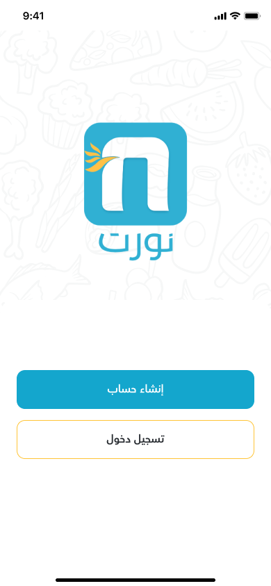

# Nawrt Food Delivery App 🍔

## This is a Flutter-based food delivery application that provides a seamless experience for browsing meals, dishes, and special offers. The app allows users to:

### 1- Explore Menus & Offers: Browse available meals, dishes, and special discounts.
### 2- User Registration: Create and manage user accounts.
### 3- Place Orders: Easily order meals from the menu.
### 4- Flexible Payment Options: Pay using credit/debit cards (Visa) or choose cash on delivery.
### 5- Order Pickup Reservations: Reserve your order at a specific restaurant branch for pickup.
### 6- Track Order Status: Check the current status of your order (e.g., in preparation, ready for pickup).
### 7- Live Delivery Tracking: Track the delivery agent in real-time as they head to your location.
### 8- Communicate with the Delivery Agent: Directly contact the agent via call or message for assistance.
### 9- This app is designed to ensure a smooth and efficient user experience for food ordering and delivery services.
### 10- Customizable Experience: Add or modify features based on the customer's preferences and requirements.
### 11- Multilingual Support: The app is available in Arabic by default, with the flexibility to provide any language the customer requests.
### 12- Supports both iOS and Android platforms with a single codebase.

## Its advantages
- Responsive UI
- Clean Code
- Can add any new features easily
- Easy to adjust colors and fonts
- Ready to integrate with API
  
# Contact Information:
## For inquiries, please contact: +201015041186 or https://www.linkedin.com/in/mahmoud-saad-a3472523a/ .🤝❤
##########################################################################

# Contact Information:
## For inquiries, please contact: +201015041186 or https://www.linkedin.com/in/mahmoud-saad-a3472523a/ .🤝❤
##########################################################################
